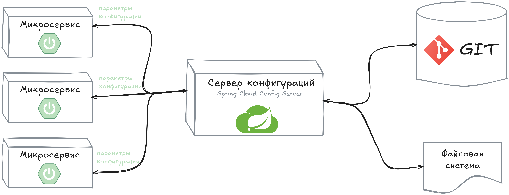

# Project Panach: Сервер Конфигураций

Сервер конфигурации на основе [Spring Cloud Config](https://spring.io/projects/spring-cloud-config) - это сервис,
который хранит, поддерживает и обрабатывает настраиваемые параметры все микросервисов проекта Panach.

Данный сервис запускается на порту _8888_ и распространяет данные конфигураций микросервисов из репозитория
[project-panach-microservices-config](https://github.com/tayviscon-io/project-panach-microservices-config).

## Проблема

* В мире микросервисов управление конфигурациями каждого сервиса в отдельности
является утомительной и трудоемкой задачей. Другими словами, если модулей много,
то управлять свойствами каждого модуля по отдельности (_присуще традиционной монолитной архитектуре_) очень сложно;
* В монолитных приложениях есть одно место, где хранятся файлы свойств.
Для внесения изменений необходимо обновить файлы конфигурации только в одном месте. В микросервисной архитектуре
каждый микросервис владеет собственными свойствами.
Это может привести к дублированию одного значения свойств в нескольких микросервисах и в случае,
если какое-то из значений будет необходимо обновить, его придется менять в каждом микросервисе.
Конечно если у вас всего пара микросервисов, такой подход не кажется из ряда вон выходящим, однако если это свойство 
используется в 10, 20 или 30 различных микросервисах,
вам придется вносить изменения в каждый из них и повторно развертывать из, чтобы изменения вступили в силу.

## Решение
Центральный сервис конфигурации помогает решить данную проблему,
так как берет на себя обязанность распространить конфигурации (_свойства_) каждому подключенному микросервису.

## Принцип работы

* Сервер конфигураций, в контексте большого количества приложений на базе микросервисной архитектуры,
дает нам возможность централизовано настраивать и управлять свойствами конфигураций всех микросервисов;
* Сервер конфигураций - это место, где хранятся и поддерживаются настраиваемые параметры всех микросервисов.
В какой-то степень это похоже на вынесение конфигурационных свойств каждого отдельного приложения во
внешний сервис с целью обеспечения возможности централизованного управления;

